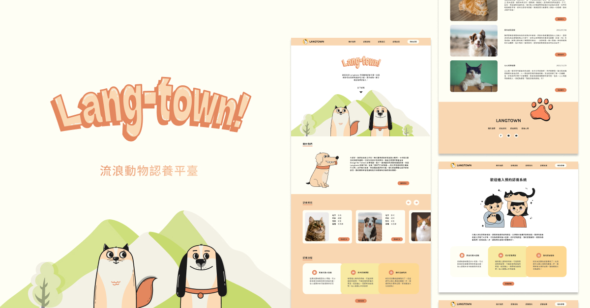

# Langtown

### 功能

- 首頁

  1. 查看目前開放認養的貓咪資訊
  2. 公開透明認養流程
  3. 了解更多認養故事

- 關於我們

  1. 了解合作組織及團體

- 認養須知

  1. 提供認養人的認養前的必備知識

- 認養資訊

  1. 提供目前開放認養的貓咪資訊

- 貓咪故事

  1. 提供更多認養貓咪的故事

- 預約認養

  1. 飼養知識小遊戲 - 趣味問答的小考驗，可以檢視是否儲備足夠的飼養知識
  2. 初步認識調查 - 表單填寫、問題有加註說明，貼心解開心中的疑惑
  3. 預約見面時段 - 表單送出後會把表單寄送到認養人及合作組織 email、後續將以表單填寫的聯絡方式以便預約見面時段

## 開發工具

- creat-react-app - 框架
- styled-component - CSS & 動態改變樣式
- react-hook-form - 表單處理及儲存
- emailJS - email 寄送
- react-router-dom - 路由處理器
- react-icons - icon 資料庫
